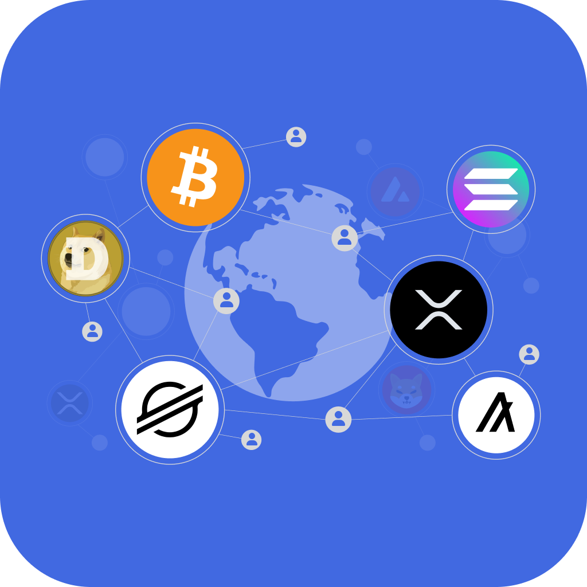

# iOS Application
## Download CryptoMe
Click Link below to Download CryptoMe on the iOS App Store

## Website: 
https://www.justcryptome.com

# App Screens:

## Summary
### Overview
CryptoMe is a cutting-edge cryptocurrency payment platform designed to make crypto transactions as easy as sending a text message. Inspired by the simplicity of Venmo, CryptoMe offers a user-friendly interface for sending, receiving, and managing XRP and other cryptocurrencies. Our platform leverages the speed and efficiency of the XRP ledger to provide instant, secure, and cost-effective transactions globally.

### Key Features
* Venmo-Like Simplicity: Enjoy a seamless and intuitive user experience, allowing you to send and receive cryptocurrencies with ease.
* XRP Wallet: Create or import your XRP wallet directly within the app. Manage your funds with full control over your secret key, which is securely stored on your device.
* Changelly Integration: Instantly exchange XRP for over 80+ cryptocurrencies directly within the app using our integrated Changelly exchange service.
* Global Transactions: Remove geographical barriers with instant global transfers. Our platform supports multiple cryptocurrencies, ensuring quick and easy transactions anywhere in the world.
* Privacy-Focused: We prioritize your privacy by operating without collecting sensitive personal data and focusing on non-FIAT currency transactions.
* Unmatched Security: CryptoMe ensures that only you can access and transact with your wallet, providing top-notch security against potential threats.

### Future Enhancements
We are continually evolving and have exciting plans on the horizon:

* Multi-Currency Wallets: Support for Bitcoin, Ethereum, Litecoin, and more.
* Phone Number Transactions: Send cryptocurrencies directly using phone numbers.
* FIAT Conversions: Seamlessly convert between FIAT and cryptocurrencies.
* Enhanced Social Features: Improved login options and sharing capabilities.

### Future UI Pics:

### Why Contribute?
  CryptoMe is not just a wallet; it's a vision to simplify and enhance the way we handle digital assets. We are looking for developers who are passionate about cryptocurrency and fintech innovation to join our journey. Whether you're interested in blockchain technology, security, or UI/UX design, there's a place for you in our project.